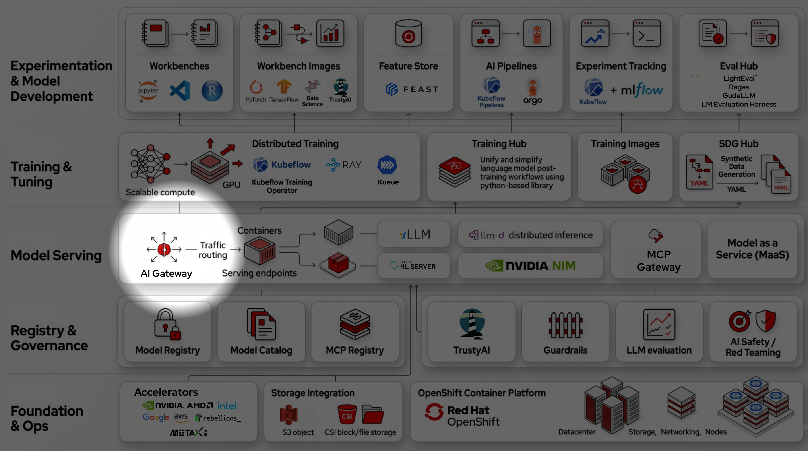
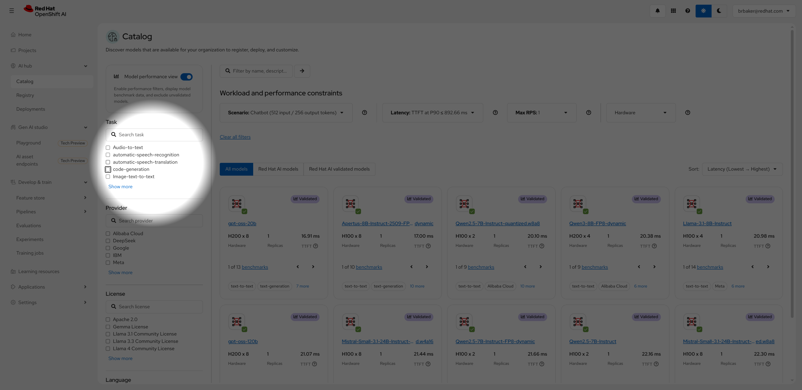

# 🔦 Spotlight Focus

A Chrome extension that dims the entire page and projects a soft spotlight wherever your cursor is. Designed for presentations, screen sharing, and live demos where you need to draw an audience's attention to a specific part of the screen.

  

---

## Features

- **Spotlight follows your cursor** with a soft, feathered edge
- **Adjustable dim level** — control how dark the surrounding area gets (10%–95%)
- **Adjustable spotlight size** — from a tight 60px to a wide 1200px diameter
- **Resize on the fly** — hold `Ctrl` and scroll while the spotlight is active
- **Works across tabs** — enabling spotlight applies to every tab you switch to
- **Works in Google Slides presentation mode** — the overlay injects directly into the presentation iframe so it appears on top of your slides
- **Works on CSP-restricted sites** — including claude.ai, using Chrome's scripting API which bypasses page-level Content Security Policies
- **Global keyboard shortcut** — toggle on/off with `Alt+Shift+D` even when the browser UI is hidden in fullscreen
- **Settings persist** — spotlight size and dim level are saved across browser sessions

---
## Examples

<table>
  <tr>
    <td align="center" valign="top"></td>
    <td align="center" valign="top"></td>
  </tr>
</table>

---

## Installation

This extension is not published to the Chrome Web Store. Install it in developer mode:

1. Download or clone this repository
2. Open Chrome and navigate to `chrome://extensions/`
3. Enable **Developer mode** using the toggle in the top-right corner
4. Click **Load unpacked**
5. Select the `spotlight-extension` folder (the one containing `manifest.json`)
6. The 🔦 Spotlight Focus icon will appear in your Chrome toolbar

NOTE: It is recommended to install the extension in the "proper" Chrome developer extensions directory. If you don't, I have seen case where Spotlight disappears from Chrome on startup. In Linux the directory is: `$HOME/.config/google-chrome/Default/Extensions`

> **After installing**, go to `chrome://extensions/shortcuts` and confirm that `Alt+Shift+D` is assigned to "Toggle spotlight on/off". If the field is empty, click it and press `Alt+Shift+D` to set it.

---

## Usage

### Turning the spotlight on and off

**Option 1 — Popup button:** Click the 🔦 icon in the toolbar and press **Enable Spotlight**.

**Option 2 — Keyboard shortcut:** Press **`Alt+Shift+D`** from anywhere, including fullscreen and Google Slides presentation mode. This is a browser-level shortcut so it works even when the Chrome UI is hidden.

### Adjusting the spotlight size

**While the spotlight is active**, hold `Ctrl` and scroll up/down with the mouse wheel. A small toast will appear at the bottom of the screen showing the current diameter. You can also use the **Spotlight size** slider in the popup.

### Adjusting the dim level

Open the popup and use the **Dim level** slider. Drag left for a lighter dim (the audience can still see the whole page), drag right for a near-blackout effect that forces focus entirely on the spotlight.

### Changing the keyboard shortcut

The global shortcut (`Alt+Shift+D`) can be changed through Chrome's built-in shortcut manager — no config files or reinstallation needed:

1. Click the **"To change: open Chrome's shortcut manager"** button in the popup — this copies `chrome://extensions/shortcuts` to your clipboard
2. Paste that address into the Chrome address bar and press Enter
3. Find **Spotlight Focus** in the list
4. Click the field next to **"Toggle spotlight on/off"**
5. Press your desired key combination
6. The shortcut is saved immediately

---

## Compatibility

| Context | Works? | Notes |
|---|---|---|
| Regular web pages | ✅ | Full support |
| CSP-restricted sites (e.g. claude.ai) | ✅ | Injected via Chrome scripting API, bypasses page CSP |
| Google Slides (edit mode) | ✅ | Full support |
| Google Slides (presentation / fullscreen) | ✅ | Overlay injects into the presentation iframe directly |
| New tabs opened after enabling | ✅ | State syncs automatically on tab load and tab switch |
| `chrome://` pages | ❌ | Chrome does not allow extensions to run on internal pages |
| Chrome Web Store pages | ❌ | Chrome blocks extension injection on its own store |

---

## File Structure

```
spotlight-extension/
├── manifest.json      # Extension manifest (MV3), declares permissions and shortcuts
├── background.js      # Service worker: manages state, tab sync, keyboard command
├── content.js         # Injected into every frame: renders overlay, handles mouse/scroll
├── popup.html         # Toolbar popup UI
├── popup.js           # Popup logic: reads/writes state, slider handlers
├── icon16.png         # Toolbar icon (16×16)
├── icon48.png         # Extensions page icon (48×48)
├── icon128.png        # Chrome Web Store icon (128×128)
└── README.md          # This file
```

---

## Architecture

### State management

All settings (`active`, `radius`, `dimOpacity`) are stored in `chrome.storage.local`. This means settings persist across browser sessions and are available to the service worker without needing an open popup.

The background service worker is the single source of truth. The popup reads from and writes to the background; the background then pushes updates to the active tab.

### Content script injection

`content.js` is declared in the manifest with `all_frames: true`, which causes Chrome to automatically inject it into every frame on every page at load time — including iframes. This is how Google Slides presentation mode is supported: the presentation canvas renders in an iframe, and the overlay runs inside that iframe directly, rather than trying to paint over it from the parent page (which is impossible due to how the browser compositor layers iframes).

For tabs that were already open when the extension was installed or reloaded, the background service worker manually injects `content.js` using `chrome.scripting.executeScript` with `allFrames: true`.

### Overlay rendering

The overlay is a single `position: fixed; inset: 0` div at `z-index: 2147483647` (the maximum). The spotlight effect is achieved using a CSS `radial-gradient` as the div's `background`:

```
radial-gradient(circle Rpx at Xpx Ypx,
  transparent <inner-edge>,
  rgba(0,0,0,<opacity>) <outer-edge>
)
```

The inner and outer edges are separated by ~12% of the radius to create a soft feathered transition. The gradient is recalculated and applied on every `mousemove` event.

The overlay uses `pointer-events: none` so all mouse clicks and interactions pass through to the page underneath.

### Cross-frame state sync

The background service worker sends state updates via `chrome.tabs.sendMessage` targeting `frameId: 0` (the top frame). The top frame's content script then relays the state to all sub-frames by iterating `document.querySelectorAll('iframe')` and calling `iframe.contentWindow.postMessage()`. Sub-frames listen for these messages and apply state locally. This avoids the need to enumerate frame IDs in the background.

### Global keyboard shortcut

The `Alt+Shift+D` shortcut is registered as a Chrome extension `command` in `manifest.json`. Chrome intercepts this at the browser level before any page or extension popup can see it, which is why it works in fullscreen presentation mode where the browser UI is hidden.

---

## Permissions

| Permission | Why it's needed |
|---|---|
| `activeTab` | Read the current tab's URL and send it messages |
| `scripting` | Inject `content.js` into tabs that were open before the extension loaded |
| `storage` | Persist spotlight settings across sessions |
| `tabs` | Listen for tab switches (`onActivated`) and page loads (`onUpdated`) to sync state |
| `webNavigation` | Enumerate frames within a tab to find presentation iframes |
| `host_permissions: <all_urls>` | Allow injection and messaging on any website |

---

## Development

No build step required. The extension is plain HTML, CSS, and JavaScript.

**To make changes:**

1. Edit the relevant file
2. Go to `chrome://extensions/`
3. Click the **↺ refresh** icon on the Spotlight Focus card
4. Reload any tabs you want to test on (the content script needs to re-inject)

**To inspect the service worker:**

On `chrome://extensions/`, click **"Service Worker"** next to Spotlight Focus to open a DevTools window attached to `background.js`. `console.warn` messages from injection failures will appear here.

**To inspect the content script:**

Open DevTools on any page where the extension is running. In the Console, use the frame selector dropdown (top-left of the Console panel) to switch between the top frame and any sub-frames to see logs from each independently.

---

## Known Limitations

- **`chrome://` pages** — Chrome prohibits any extension from running on its own internal pages. The spotlight cannot be used on the new tab page, settings, or `chrome://extensions/` itself.
- **Spotlight size via scroll** — `Ctrl+scroll` to resize only works when the cursor is over the page, not over browser UI elements like the address bar.
- **Google Meet / video call overlays** — Some video conferencing tools render their UI in ways that may partially obscure the spotlight overlay. The spotlight still works but may not cover call controls.

---

## License

MIT — do whatever you like with it.
